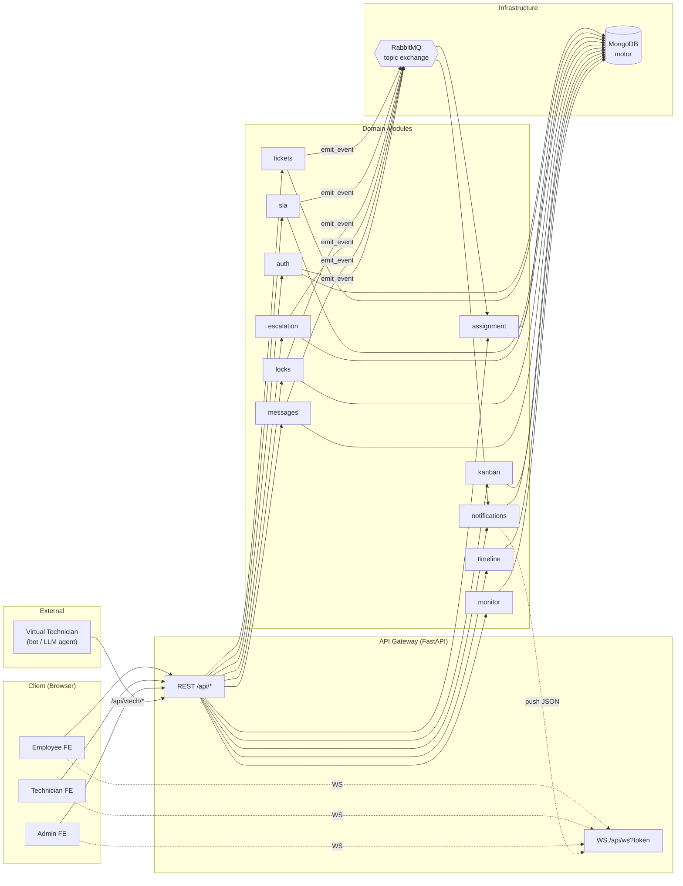
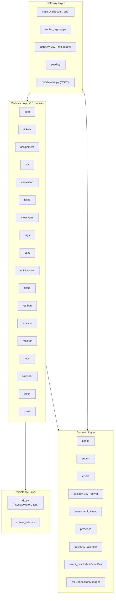
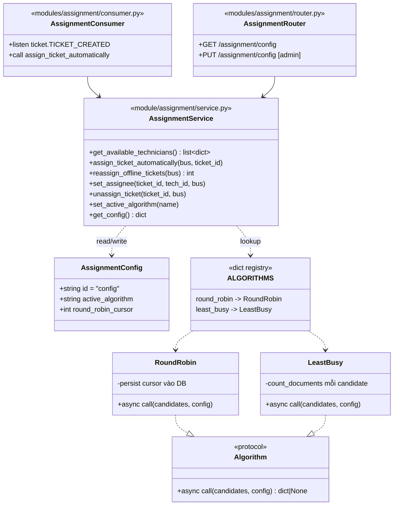
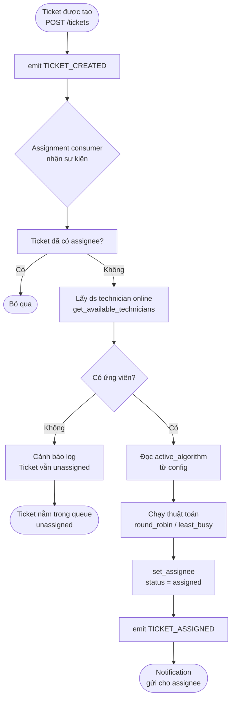
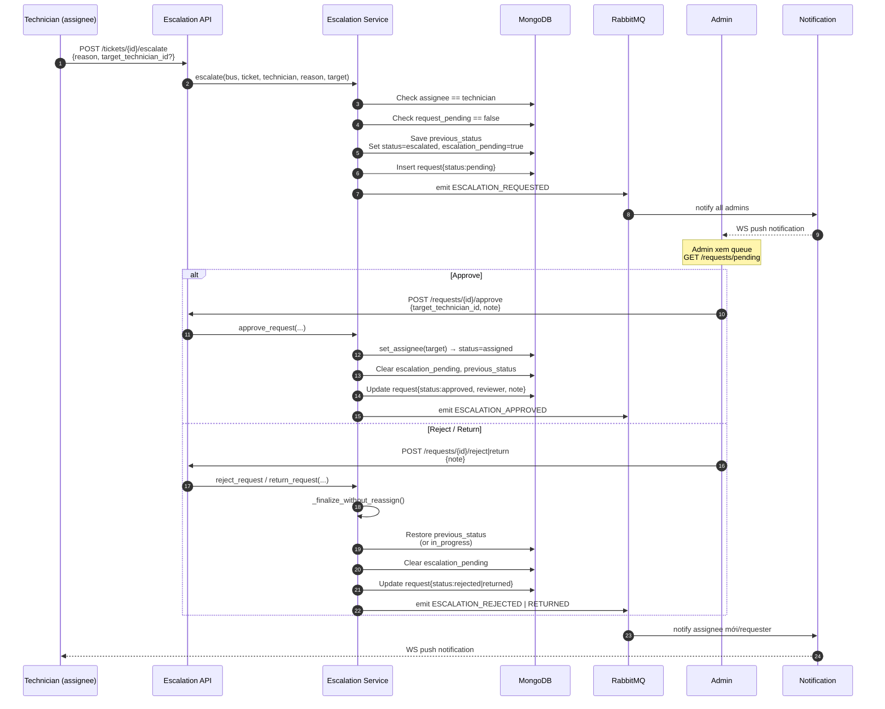
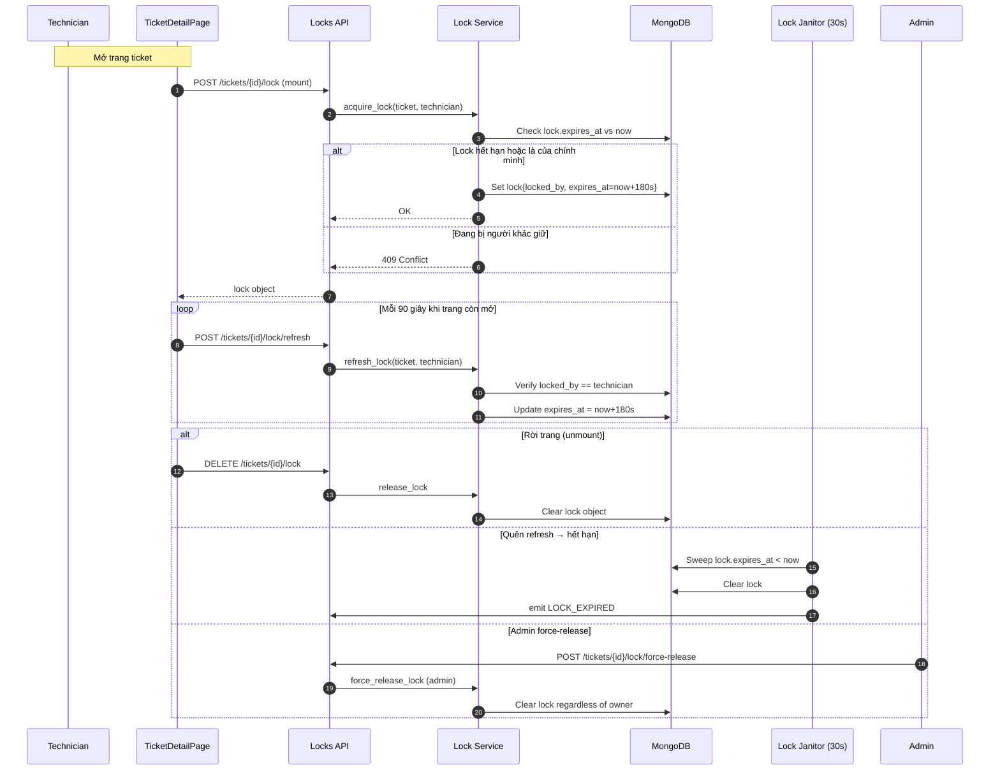
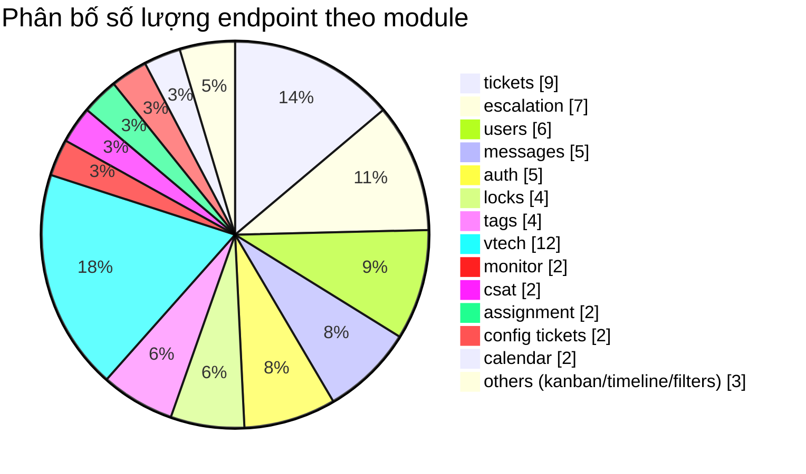
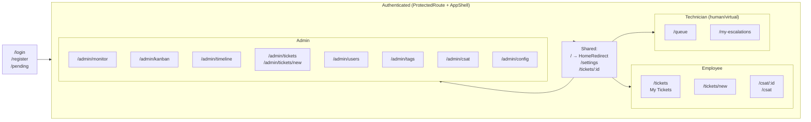
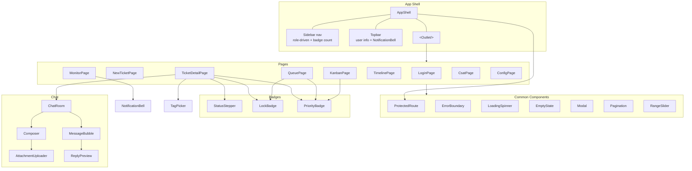
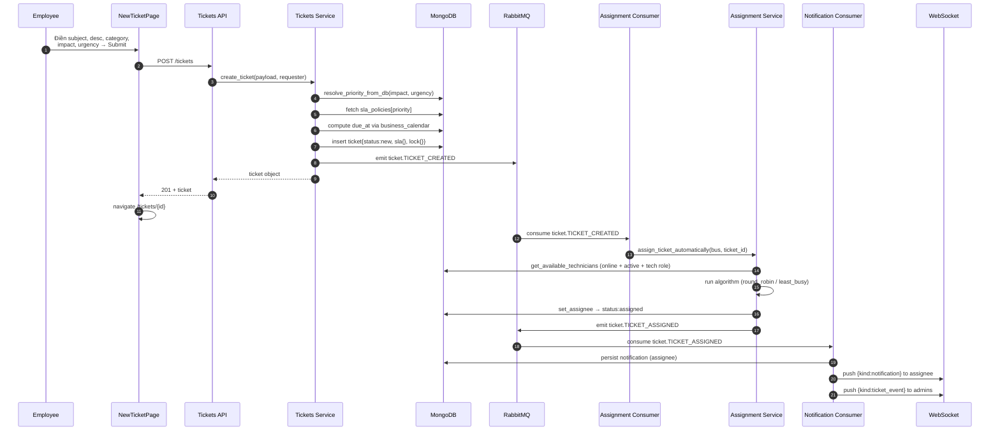

# Báo cáo Mini-Project — Hệ thống Helpdesk / ITSM
### Chương trình Viettel Digital Talent 2026 — Lĩnh vực Software Engineer

> **Đề tài:** *Thiết kế và xây dựng hệ thống Helpdesk / ITSM quản lý vòng đời ticket với cơ chế phân công tự động, theo dõi SLA, escalation và event-bus thời gian thực.*

File báo cáo này được trình bày dưới dạng Markdown với các sơ đồ **Mermaid** nhúng sẵn (render trực tiếp trên GitHub/GitLab/VS Code). Toàn bộ nội dung được đối chiếu với mã nguồn thực tế trong `backend/` và `frontend/`, các điểm khác biệt so với tài liệu thiết kế gốc được đánh dấu rõ trong từng mục.

---

## Mục lục

0. [Trang bìa](#0-trang-bìa)
1. [Lời mở đầu](#1-lời-mở-đầu)
2. [Tóm tắt nội dung và đóng góp](#2-tóm-tắt-nội-dung-và-đóng-góp)
3. [Danh mục hình vẽ / bảng / đồ thị](#3-danh-mục-hình-vẽ--bảng--đồ-thị)
4. [I. Giới thiệu](#i-giới-thiệu)
5. [II. Nội dung và phương pháp](#ii-nội-dung-và-phương-pháp)
   - [II.1 Kiến trúc phân lớp](#ii1-kiến-trúc-phân-lớp)
   - [II.2 Mô hình dữ liệu](#ii2-mô-hình-dữ-liệu)
   - [II.3 Vòng đời ticket (State Machine)](#ii3-vòng-đời-ticket-state-machine)
   - [II.4 Thuật toán phân công (Assignment)](#ii4-thuật-toán-phân-công-assignment)
   - [II.5 Cơ chế Escalation & Reassignment](#ii5-cơ-chế-escalation--reassignment)
   - [II.6 Cơ chế khoá ticket (Lock TTL)](#ii6-cơ-chế-khoá-ticket-lock-ttl)
   - [II.7 Event Bus & hệ thống sự kiện](#ii7-event-bus--hệ-thống-sự-kiện)
   - [II.8 Notification thời gian thực](#ii8-notification-thời-gian-thực)
   - [II.9 API & WebSocket](#ii9-api--websocket)
   - [II.10 Giao diện người dùng (Frontend)](#ii10-giao-diện-người-dùng-frontend)
   - [II.11 Virtual Technician SDK](#ii11-virtual-technician-sdk)
6. [III. Kết quả thực hiện và đánh giá](#iii-kết-quả-thực-hiện-và-đánh-giá)
7. [IV. Kết luận & hướng phát triển](#iv-kết-luận--hướng-phát-triển)
8. [Tài liệu tham khảo](#tài-liệu-tham-khảo)

---

## 0. Trang bìa

| Trường | Giá trị |
|---|---|
| **Tên đề tài** | Thiết kế và xây dựng hệ thống Helpdesk/ITSM quản lý ticket với cơ chế phân công tự động, SLA và event bus |
| **Chương trình** | Viettel Digital Talent 2026 — Mini-project Software Engineer |
| **Sinh viên thực hiện** | _[điền tên + email]_ |
| **Mentor / Đơn vị** | _[điền tên mentor + đơn vị]_ |
| **Repo mã nguồn** | `C:\Projects\VDT` (git) |
| **Ngày lập báo cáo** | 07/07/2026 |

> Logo Viettel và các thông tin định danh sinh viên/mentor sẽ được chèn trực tiếp vào file `.docx` xuất từ template `_Template__Dàn_bài_báo_cáo.docx` — không nằm trong phạm vi file Markdown này.

---

## 1. Lời mở đầu

Trong các doanh nghiệp vừa và nhỏ, quy trình xử lý sự cố IT/suppport nội bộ thường được thực hiện thủ công qua email, spreadsheet hoặc các nhóm chat rời rạc. Cách tiếp cận này dẫn đến những hạn chế rõ rệt:

- **Không phân loại mức độ nghiêm trọng**: mọi ticket được xử lý theo thứ tự FIFO, không phân biệt một ticket làm gián đoạn nghiệp vụ cốt lõi với một yêu cầu nhỏ.
- **Phân công thủ công**: quản lý phải tự duyệt và giao việc, gây độ trễ từ vài phút đến vài giờ.
- **Không giám sát SLA**: không có cơ chế cảnh báo khi sắp quá hạn phản hồi/giải quyết.
- **Khó tích hợp**: dữ liệu xử lý không có một luồng sự kiện chung để dashboard, notification, audit-log cùng consume.

Đề tài đặt ra mục tiêu xây dựng một hệ thống **Helpdesk / ITSM nội bộ** dạng modular, hướng sự kiện (event-driven), có khả năng:

- Tự động hoá toàn bộ vòng đời ticket từ lúc tạo đến lúc đóng.
- Tự động suy diễn **mức ưu tiên (priority)** và **chính sách SLA** từ ma trận *Urgency × Impact*.
- Tự động phân công kỹ thuật viên (kể cả bot ảo) theo thuật toán **có thể thay đổi lúc runtime**.
- Cảnh báo và leo thang (escalation) khi kỹ thuật viên hiện tại không thể xử lý.
- Cung cấp dashboard thời gian thực (Kanban, Timeline, Monitor) dựa trên **một event bus chung**.
- Tích hợp được với hệ thống ngoài (bot/LLM) qua SDK và API riêng.

Đề tài nằm trong khuôn khổ mini-project cá nhân của chương trình Viettel Digital Talent 2026, lĩnh vực Software Engineer — nhằm thực hành thiết kế kiến trúc backend + frontend toàn stack có tính đến các bài toán thực tế của một hệ thống ITSM.

---

## 2. Tóm tắt nội dung và đóng góp

**Hệ thống đã cài đặt** gồm:

- **Backend** Python bất đồng bộ với FastAPI, chia làm 4 lớp (`gateway / common / persistence / modules`) với quy tắc phụ thuộc 1 chiều, gồm **18 module nghiệp vụ** độc lập.
- **Cơ sở dữ liệu** MongoDB (qua driver bất đồng bộ `motor`). *(Lưu ý: tài liệu thiết kế gốc ghi DuckDB — chuyển sang MongoDB là quyết định sản phẩm, xem `README.md`.)*
- **Event bus** RabbitMQ topic exchange, là nguồn phát tán duy nhất cho mọi sự kiện hệ thống, đồng thời **dual-write** vào collection `events` làm audit log.
- **State machine** cho ticket với 7 trạng thái và các chuyển dịch được kiểm soát chặt (`new → assigned → in_progress → escalated → resolved/rejected`).
- **Ma trận ưu tiên + chính sách SLA** tự động suy diễn, có thể chỉnh sửa trực tiếp qua giao diện Admin mà không cần restart.
- **Thuật toán phân công dạng registry** (`round_robin`, `least_busy`), chọn runtime qua config admin, mở rộng chỉ cần thêm 1 hàm + 1 dòng đăng ký.
- **Cơ chế khoá ticket có TTL** (180s, refresh 90s) tránh xung đột xử lý đồng thời, kèm job quét dọn tự động.
- **Escalation/Reassignment** theo luồng yêu cầu do assignee hiện tại đề xuất → admin duyệt / từ chối / trả lại, trạng thái ticket được khôi phục đúng khi bị từ chối.
- **Notification** dạng subscriber dịch sự kiện thành thông báo theo người nhận, đẩy qua WebSocket.
- **4 background job** (SLA checker, lock janitor, presence janitor, reassignment sweep) chạy vòng lặp asyncio.
- **Frontend** React 19 + TypeScript, CSS viết tay hoàn toàn, phân luồng UI theo 4 vai trò (Employee / Technician Human / Technician Virtual / Admin), với Kanban, Timeline dạng Gantt + Event Log, Monitor dashboard, Chat room kiểu Messenger, CSAT.
- **Virtual Technician SDK** (`helpdesk-vtech-sdk`) — thư viện Python async đóng gói toàn bộ API `/vtech/*`, tự heartbeat presence và lắng nghe WebSocket theo decorator.

**Kết quả**: toàn bộ luồng nghiệp vụ cốt lõi (tạo ticket → auto-assign → chat → escalate → resolve → CSAT) chạy được end-to-end, có thể demo trực tiếp trên localhost.

---

## 3. Danh mục hình vẽ / bảng / đồ thị

| # | Loại | Tên | Công cụ |
|---|---|---|---|
| Hình 1 | Sơ đồ | Kiến trúc tổng quan hệ thống | Mermaid |
| Hình 2 | Sơ đồ | Kiến trúc 4 lớp backend | Mermaid |
| Hình 3 | ERD | Mô hình dữ liệu (simplified) | Mermaid |
| Hình 4 | State diagram | Vòng đời ticket | Mermaid |
| Hình 5 | Class diagram | Assignment registry (plug-and-play) | Mermaid |
| Hình 6 | Flowchart | Luồng phân công tự động | Mermaid |
| Hình 7 | Sequence | Luồng escalation & duyệt/từ chối | Mermaid |
| Hình 8 | Sequence | Vòng đời lock TTL | Mermaid |
| Hình 9 | Sơ đồ | Pub/Sub Event Bus RabbitMQ | Mermaid |
| Hình 10 | Sơ đồ | Cây route frontend theo vai trò | Mermaid |
| Hình 11 | Component | Sơ đồ component frontend | Mermaid |
| Hình 12 | Sequence | Luồng tạo ticket end-to-end | Mermaid |
| Hình 13 | Sequence | Luồng WebSocket + heartbeat realtime | Mermaid |
| Bảng 1 | Bảng | Ma trận Urgency × Impact → Priority | Markdown |
| Bảng 2 | Bảng | Chính sách SLA theo Priority | Markdown |
| Bảng 3 | Bảng | Ánh xạ EventType → Notification | Markdown |
| Bảng 4 | Bảng | Danh mục API endpoint (REST) | Markdown |
| Bảng 5 | Bảng | Background job & chu kỳ | Markdown |
| Bảng 6 | Bảng | Kết quả kiểm thử | Markdown |
| Đồ thị 1 | Pie | Tỷ trọng endpoint theo module | Mermaid |

---

## I. Giới thiệu

### I.1 Đặt vấn đề

Quy trình xử lý ticket thủ công trong doanh nghiệp có các điểm yếu đã nêu ở [mục 1](#1-lời-mở-đầu). Bên cạnh đó, các hệ thống ITSM thương mại (Jira Service Management, ServiceNow, Zendesk) thường nặng nề, đắt đỏ và khó tuỳ biến sâu. Một giải pháp **tự xây dựng, modular, event-driven** cho phép:

- Kiểm soát toàn bộ luồng nghiệp vụ và dữ liệu.
- Dễ dàng thay thế từng thành phần (DB, thuật toán phân công, kênh thông báo).
- Tích hợp được với hệ thống ngoài (chatbot, monitoring, ERP) qua event bus chung.

### I.2 Mục tiêu đề tài

1. Tự động hoá vòng đời ticket từ khi tạo đến khi đóng/quay lại đánh giá.
2. Tự động tính priority & SLA từ ma trận Urgency × Impact (có thể cấu hình lại online).
3. Tự động phân công kỹ thuật viên theo thuật toán **plug-and-play**, ưu tiên bot ảo trước.
4. Cơ chế leo thang/điều chuyển có kiểm soát qua **hàng đợi admin**.
5. Giám sát thời gian thực qua event bus + WebSocket + dashboard.

### I.3 Phạm vi triển khai

- **Trong phạm vi**: thiết kế và cài đặt đầy đủ backend (FastAPI + MongoDB + RabbitMQ), frontend khung (React), SDK Virtual Technician, 4 background job, kiểm thử e2e.
- **Ngoài phạm vi**: spam filter thật (chỉ stub `modules/filters`), triển khai production-grade (chưa có rate limiting, không có horizontal scaling), Virtual Technician AI logic thật (SDK chỉ là client, tự mang logic AI của riêng mình).

### I.4 Hình 1 — Sơ đồ kiến trúc tổng quan hệ thống



**Chú thích**: Mũi tên nét liền là lời gọi HTTP/DB, nét đứt là WebSocket. Mọi sự kiện nghiệp vụ đi qua `emit_event` (common/events.py) — vừa ghi vào `db.events` (audit log), vừa publish lên RabbitMQ exchange `helpdesk.events`.

---

## II. Nội dung và phương pháp

### II.1 Kiến trúc phân lớp

Backend chia làm **4 lớp** với quy tắc phụ thuộc **một chiều** (lớp trên được phép import lớp dưới, không ngược lại):

| Lớp | Thư mục | Trách nhiệm |
|---|---|---|
| **Gateway** | `gateway/` | FastAPI app, lifespan (seed + event bus + jobs), CORS, exception handlers, router registry, deps (JWT, role guard, bus, ws manager) |
| **Modules** | `modules/` (18 module) | Mỗi module = 1 thư mục chứa `router.py` + `service.py` (+ `schemas.py`, `consumer.py`, `job.py` tuỳ module). Đây là nơi chứa toàn bộ business logic |
| **Persistence** | `persistence/` | Helper Mongo: `db.py` (client, `new_id`, `serialize_doc`, `create_indexes`). Không có repository pattern abstraction — modules gọi trực tiếp `db.<collection>` |
| **Common** | `common/` | Config, enums, errors, security (JWT/bcrypt), events (emit_event), presence, business_calendar, event_bus (RabbitMQ), ws manager |

**Quy tắc kiến trúc quan trọng**:
- Kanban/Timeline/Monitor/Notification **không gọi thẳng** tới service của module khác — chúng chỉ là **subscriber** của event bus hoặc **read-view** của collection `events`/`tickets`. Điều này tách biệt hoàn toàn phần ghi nghiệp vụ (write side) và phần truy vấn/dashboards (read side).
- Modules không được import gateway (để tránh phụ thuộc ngược).
- `emit_event` là điểm chốt duy nhất để phát sự kiện → đảm bảo tính nhất quán cho audit log.

> **Lưu ý thiết kế**: persistence layer hiện chỉ có `db.py` trần, không có lớp repository trừu tượng (thư mục `persistence/repositories/` tồn tại nhưng rỗng). Đây là một điểm có thể cải thiện nếu muốn mock được DB khi test.

### Hình 2 — Sơ đồ 4 lớp



---

### II.2 Mô hình dữ liệu

Hệ thống dùng **MongoDB** (driver `motor`). Một quy ước xuyên suốt: **mỗi document có một `id` dạng chuỗi UUID, và giá trị đó cũng chính là `_id`** — nhờ vậy document nào cũng có thể JSON hoá trực tiếp sau khi bỏ `_id`, không cần xử lý `ObjectId`.

**Các collection chính**:

| Collection | Mục đích | Trường khoá |
|---|---|---|
| `users` | Tài khoản người dùng | `username` (unique), `role`, `status`, `password_hash`, `last_login_at` |
| `tickets` | Ticket hỗ trợ | `requester_id`, `assignee_id`, `status`, `priority`, `tags[]`, `sla{}`, `lock{}`, `escalation_pending` |
| `messages` | Tin nhắn trong ticket room | `ticket_id`, `sender_id`, `content`, `reply_to_message_id`, `reply_preview`, `attachments[]` |
| `requests` | Yêu cầu escalation/reassignment | `ticket_id`, `request_type`, `requester_id`, `target_technician_id`, `status`, `reviewer_id`, `note`, `previous_status` |
| `tags` | Nhãn dán ticket | `name` (unique, lowercase), `color` |
| `csat_surveys` | Đánh giá hài lòng (1 ticket / 1 survey) | `ticket_id` (unique), `requester_id`, `technician_id`, `status`, `rating`, `comment` |
| `events` | Audit log toàn hệ thống (dual-write với RabbitMQ) | `routing_key`, `domain`, `event_type`, `actor_id`, `ticket_id`, `payload`, `created_at` |
| `notifications` | Thông báo người dùng | `user_id`, `type`, `title`, `body`, `read_at` |
| `priority_matrix` | Ma trận Urgency×Impact→Priority | `id={impact}_{urgency}`, `priority` |
| `sla_policies` | Chính sách SLA theo Priority | `id=P1..P4`, `first_response_minutes`, `resolve_minutes` |
| `assignment_config` | Config thuật toán phân công | `id="config"`, `active_algorithm`, `round_robin_cursor` |
| `business_calendar` | Lịch làm việc cho tính SLA | `business_days`, `start_hour/min`, `end_hour/min`, `holidays[]` |

**Khóa và index** (`persistence/db.py:create_indexes`):
- `users`: `username` (unique), `role`, `status`, `created_at`
- `tickets`: `requester_id`, `assignee_id`, `status`, `priority`, `tags`, `created_at`
- `messages`: `ticket_id`
- `events`: `created_at`, `ticket_id`
- `notifications`: `user_id`
- `csat_surveys`: `ticket_id` (unique), `requester_id`, `technician_id`, `status`

**Vì sao lock/SLA không tách thành bảng riêng**: block `lock{}` và `sla{}` được nhúng trực tiếp vào document `tickets` vì có quan hệ 1-1 và luôn truy cập cùng lúc với ticket — đây là mô hình "rich document" phù hợp với Mongo.

> ⚠️ **Bất nhất cần ghi nhận**: `create_indexes` tạo index cho collection tên `escalation_requests`, nhưng module escalation thực tế đọc/ghi vào collection `requests` (xem `modules/escalation/service.py`). Collection `escalation_requests` hiện không được sử dụng và `requests` không có index ngoài index mặc định của `_id`. Đây là một điểm cần sửa khi ra production.

### Hình 3 — ERD (simplified)

```mermaid
erDiagram
    users ||--o{ tickets : "requester_id"
    users ||--o{ tickets : "assignee_id"
    users ||--o{ messages : "sender_id"
    users ||--o{ notifications : "user_id"
    users ||--o{ requests : "requester_id"
    users ||--o{ requests : "target_technician_id"
    users ||--o{ requests : "reviewer_id"

    tickets ||--o{ messages : "ticket_id"
    tickets ||--o{ requests : "ticket_id"
    tickets ||--o{ events : "ticket_id"
    tickets ||--|| csat_surveys : "ticket_id"
    tickets }o--o{ tags : "tags[]"

    messages }o--o| messages : "reply_to_message_id"

    users {
        string id PK
        string username UK
        string email
        string role
        string status
        string password_hash
        datetime last_login_at
    }
    tickets {
        string id PK
        string requester_id FK
        string assignee_id FK
        string subject
        string status
        string priority
        string category
        string impact
        string urgency
        list tags
        object sla
        object lock
        bool escalation_pending
        datetime created_at
        datetime resolved_at
    }
    messages {
        string id PK
        string ticket_id FK
        string sender_id FK
        string content
        string reply_to_message_id FK
        string reply_preview
        list attachments
        datetime created_at
    }
    requests {
        string id PK
        string ticket_id FK
        string request_type
        string requester_id FK
        string target_technician_id FK
        string status
        string reviewer_id FK
        string note
        string previous_status
        datetime created_at
    }
    csat_surveys {
        string id PK
        string ticket_id FK_UK
        string requester_id FK
        string technician_id FK
        string status
        int rating
        string comment
        datetime created_at
    }
    events {
        string id PK
        string routing_key
        string domain
        string event_type
        string actor_id
        string ticket_id
        json payload
        datetime created_at
    }
    priority_matrix {
        string id PK
        string priority
    }
    sla_policies {
        string id PK
        int first_response_minutes
        int resolve_minutes
    }
```

---

### II.3 Vòng đời ticket (State Machine)

Ticket có **7 trạng thái** (`common/enums.py:TicketStatus`):

| Trạng thái | Ý nghĩa | Thuộc nhóm |
|---|---|---|
| `new` | Vừa tạo, chưa được phân công | OPEN |
| `assigned` | Đã có assignee, chưa có tin nhắn phản hồi đầu tiên | OPEN |
| `in_progress` | Đã có phản hồi đầu tiên từ technician | OPEN |
| `escalated` | Assignee hiện tại đã gửi yêu cầu escalation, chờ admin duyệt | OPEN |
| `resolved` | Đã giải quyết (terminal) | CLOSED |
| `rejected` | Bị từ chối xử lý (terminal) | CLOSED |
| `closed` | (Khai báo trong enum nhưng **không có code path nào set trạng thái này**) | CLOSED |

Trong đó `OPEN_TICKET_STATUSES = {new, assigned, in_progress, escalated}` — đây là điều kiện lọc cho SLA checker, assignment sweep, queue view.

**Quy tắc nghiệp vụ quan trọng**:
- **Terminal state không mở lại**: hàm `resolve_ticket` / `reject_ticket` kiểm tra `status in (RESOLVED, REJECTED, CLOSED)` và trả lỗi 409 nếu đã terminal.
- **Breach không phải trạng thái**: breach/near-breach được lưu là các flag boolean trong `ticket.sla` (`first_response_breached`, `resolve_breached`, `*_near_breach`), không thay đổi trạng thái chính.
- **`escalated` khôi phục được**: khi admin từ chối/trả lại escalation, trạng thái được phục hồi về `previous_status` (hoặc `in_progress` nếu không có).

### Hình 4 — State diagram ticket

```mermaid
stateDiagram-v2
    [*] --> new : Tạo ticket<br/>POST /tickets

    new --> assigned : Auto-assign<br/>(TICKET_CREATED consumer)
    new --> assigned : Admin approve escalation<br/>set_assignee(target)

    assigned --> in_progress : Technician gửi<br/>tin nhắn đầu tiên<br/>(record_first_response)
    assigned --> escalated : Assignee escalate
    assigned --> new : unassign_ticket<br/>(assignee offline, không thay thế)

    in_progress --> escalated : Assignee escalate<br/>hoặc reassign-request
    in_progress --> resolved : resolve_ticket
    in_progress --> rejected : reject_ticket

    escalated --> in_progress : Admin reject/return<br/>khôi phục previous_status
    escalated --> assigned : Admin approve<br/>set_assignee(target)
    escalated --> resolved : resolve_ticket<br/>(sau khi thoát escalated)
    escalated --> rejected : reject_ticket

    resolved --> [*]
    rejected --> [*]

    note right of resolved
        Tạo CSAT survey tự động
        (csat_surveys, unique per ticket)
    end note

    note right of closed
        Khai báo trong enum nhưng
        KHÔNG có code path set trạng thái này
    end note
```

---

### II.4 Thuật toán phân công (Assignment)

Assignment được triển khai theo **registry pattern dạng hàm** (function registry), không phải class-based strategy pattern như tài liệu thiết kế gốc mô tả. Đây là điểm thực tế quan trọng cần ghi nhận.

**File `modules/assignment/algorithms.py`**:

```python
async def round_robin(candidates: list[dict], config: dict) -> dict | None:
    if not candidates:
        return None
    cursor = config.get("round_robin_cursor", 0) % len(candidates)
    chosen = candidates[cursor]
    await db.assignment_config.update_one(
        {"id": "config"},
        {"$set": {"round_robin_cursor": (cursor + 1) % len(candidates)}},
    )
    return chosen


async def least_busy(candidates: list[dict], config: dict) -> dict | None:
    if not candidates:
        return None
    best, best_count = None, None
    for tech in candidates:
        count = await db.tickets.count_documents(
            {"assignee_id": tech["id"], "status": {"$in": list(OPEN_TICKET_STATUSES)}}
        )
        if best_count is None or count < best_count:
            best, best_count = tech, count
    return best


ALGORITHMS = {"round_robin": round_robin, "least_busy": least_busy}
```

**Đặc điểm "plug-and-play"**:
- Thêm thuật toán mới = viết thêm một `async def(candidates, config) -> dict | None` và đăng ký vào dict `ALGORITHMS`.
- Chọn thuật toán runtime qua `PUT /api/assignment/config` (admin) — lưu vào `db.assignment_config.active_algorithm`.
- Mặc định: `round_robin` với con trỏ `round_robin_cursor` được persist vào DB (duy trì giữa các restart).

**Tiêu chí chọn ứng viên** (`get_available_technicians`):
- `role ∈ {technician_human, technician_virtual}` (cả bot và người).
- `status == active`.
- **Đang online** (kiểm tra qua in-memory presence tracker, TTL 45s).

> **Quyết định thiết kế quan trọng**: nếu không có technician nào online, ticket **không được phân công** và rơi vào hàng đợi "unassigned" (không fallback sang offline staff). Lý do: tránh giao ticket cho người không hoạt động rồi treo vô thời hạn. Một job quét định kỳ (`reassign_offline_tickets` mỗi 20s) sẽ tự động chuyển ticket của assignee vừa offline sang người online khác, hoặc unassign nếu không còn ai.

### Hình 5 — Class/Component diagram Assignment



### Hình 6 — Flowchart luồng phân công



---

### II.5 Cơ chế Escalation & Reassignment

> ⚠️ **Khác biệt với tài liệu thiết kế gốc**: tài liệu gốc mô tả luồng escalation 3 cấp "Virtual → Human → Admin" với hàng đợi admin riêng và tag REJECTED khi bị từ chối. **Trong code thực tế**, escalation/reassignment là một **luồng yêu cầu chung** do assignee hiện tại (bất kể là human hay virtual) đề xuất, admin có 3 lựa chọn xử lý. Không có tag REJECTED riêng — `rejected` ở đây chỉ là `RequestStatus`.

**Mô hình thực tế** (`modules/escalation/service.py`):

- Hai loại yêu cầu: `escalation` (leo thang lên người khác) và `reassignment` (điều chuyển sang người khác).
- Chỉ **assignee hiện tại** được quyền tạo yêu cầu (403 nếu không phải).
- Một ticket chỉ có **một yêu cầu pending** tại một thời điểm (409 nếu đã pending).

**Vòng đời yêu cầu** (`RequestStatus`): `pending → approved | rejected | returned`.

**Khi tạo yêu cầu** (`_create_request`):
- Với escalation: lưu `previous_status`, set `ticket.status = escalated`, set `ticket.escalation_pending = true`.
- Với reassignment: không thay đổi status (vẫn `in_progress`).
- Emit sự kiện tương ứng (`ESCALATION_REQUESTED` / `REASSIGN_REQUESTED`).

**Khi admin xử lý**:
- `approve_request`: cần `target_technician_id` (cung cấp hoặc lấy từ request). Gọi `set_assignee` → `status = assigned`. Clear `escalation_pending`/`previous_status`. Đánh dấu request `approved` + reviewer + note. Emit `*_APPROVED`.
- `reject_request` / `return_request`: gọi `_finalize_without_reassign`:
  - Với escalation: khôi phục `previous_status` (hoặc `in_progress` nếu thiếu).
  - Clear `escalation_pending`.
  - Đánh dấu request `rejected`/`returned`.
  - Emit `*_REJECTED` / `*_RETURNED`.

**"Hàng đợi admin"** chính là collection `requests` được lọc `status == pending`, sắp xếp theo thời gian tạo tăng dần (`GET /requests/pending`).

### Hình 7 — Sequence diagram escalation



---

### II.6 Cơ chế khoá ticket (Lock TTL)

Khi một technician/admin mở trang chi tiết ticket, hệ thống tự **khoá** ticket để tránh hai người cùng xử lý. Cơ chế khoá:

- **Lưu trong document ticket** (không phải bảng riêng): `ticket.lock = {locked_by, locked_at, expires_at}`.
- **TTL = 180 giây** (`settings.lock_ttl_seconds`).
- **Refresh mỗi 90 giây** ở phía frontend (`TicketDetailPage`) — đảm bảo không bao giờ hết hạn khi trang còn mở.
- **Release khi rời trang** (component unmount) — gọi `DELETE /tickets/{id}/lock`.
- **Admin có thể force-release**: `POST /tickets/{id}/lock/force-release`.
- **Quy tắc acquire**: nếu lock hiện tại đã hết hạn hoặc do chính mình giữ → ghi đè. Nếu đang bị người khác giữ và chưa hết hạn → trả 409 Conflict.
- **Janitor quét**: background job `lock_janitor_loop` chạy mỗi **30 giây**, tìm ticket có `lock.expires_at < now`, clear lock và emit `LOCK_EXPIRED`.

**Endpoint** (`modules/locks/router.py`):
- `POST /api/tickets/{id}/lock` — acquire (technician/admin).
- `POST /api/tickets/{id}/lock/refresh` — refresh (chỉ holder).
- `DELETE /api/tickets/{id}/lock` — release (chỉ holder).
- `POST /api/tickets/{id}/lock/force-release` — force (admin).

> **Lý do không dùng Redis (hiện tại)**: hệ thống single-instance nên in-document lock đủ dùng. Khi scale nhiều instance sẽ cần chuyển sang Redis distributed lock.

### Hình 8 — Sequence diagram vòng đời lock



---

### II.7 Event Bus & hệ thống sự kiện

**Sự kiện là nguồn sự thật duy nhất cho phần thông báo/monitoring**. Mọi thay đổi trạng thái nghiệp vụ đi qua `emit_event` (common/events.py), được **dual-write**:
1. **Persist vào `db.events`** → làm nguồn cho Timeline/Monitor (audit log).
2. **Publish lên RabbitMQ exchange** → làm nguồn cho các consumer real-time.

**Exchange**: `helpdesk.events` — topic exchange, durable, `prefetch_count=10`.

**Routing key pattern**: `f"{domain}.{event_type}"`. Ví dụ:
- `ticket.TICKET_CREATED`, `ticket.TICKET_ASSIGNED`, `ticket.TICKET_RESOLVED`
- `sla.SLA_NEAR_BREACH_RESOLVE`, `sla.SLA_BREACHED_FIRST_RESPONSE`
- `escalation.ESCALATION_REQUESTED`, `reassign.REASSIGN_APPROVED`
- `lock.LOCK_EXPIRED`, `message.MESSAGE_CREATED`, `csat.CSAT_REQUESTED`

**Queue & binding** (`rabbit_bus.py:QUEUE_BINDINGS`):

| Queue | Binding key | Consumer | Trạng thái |
|---|---|---|---|
| `notification.queue` | `#` (mọi sự kiện) | `make_notification_consumer` | **Active** — build recipients, persist notification, push WS |
| `assignment.queue` | `ticket.TICKET_CREATED` | `make_assignment_consumer` | **Active** — auto-assign ticket mới |
| `sla.queue` | `sla.*` | `make_sla_consumer` | **Placeholder** — chỉ log (logic SLA chạy trong periodic job) |
| `escalation.queue` | `escalation.*`, `reassign.*` | `make_escalation_consumer` | **Placeholder** — chỉ log (approval chạy đồng bộ trong API) |
| `vtech.queue` | `#` | — (không có consumer in-process) | Dành cho SDK bên ngoài bind consumer |

> **Diễn giải**: trong kiến trúc hiện tại, chỉ `notification.queue` và `assignment.queue` mang logic nghiệp vụ thật. SLA chạy periodic job (định kỳ quét) thay vì event-driven thuần; escalation approval chạy đồng bộ khi admin gọi API. Hai queue còn lại được **dựng sẵn** để dễ mở rộng khi tách tiến trình hoặc vươn ra microservices.

### Hình 9 — Pub/Sub Event Bus

```mermaid
flowchart LR
    subgraph Publishers["Publishers (modules)"]
        P1[tickets service]
        P2[assignment service]
        P3[sla job]
        P4[escalation service]
        P5[locks service]
        P6[messages service]
        P7[auth/users service]
    end

    EMIT["emit_event()<br/>common/events.py"]
    EMIT persist --> DBEVENTS[("db.events<br/>(audit log)")]

    P1 & P2 & P3 & P4 & P5 & P6 & P7 --> EMIT

    EMIT -->|publish routing_key| EX{{"Exchange:<br/>helpdesk.events<br/>(topic)"}}

    EX -- "# " --> Q1[/"notification.queue"/]
    EX -- "ticket.TICKET_CREATED" --> Q2[/"assignment.queue"/]
    EX -- "sla.*" --> Q3[/"sla.queue"/]
    EX -- "escalation.* / reassign.*" --> Q4[/"escalation.queue"/]
    EX -- "#" --> Q5[/"vtech.queue<br/>(no in-process consumer)"/]

    Q1 --> C1[Notification consumer]
    Q2 --> C2[Assignment consumer]
    Q3 -.-> C3[SLA consumer<br/>(placeholder)]
    Q4 -.-> C4[Escalation consumer<br/>(placeholder)]

    C1 --> WS[WS push → browser]
    C2 --> SETASSIGN[set_assignee]
```

---

### II.8 Notification thời gian thực

Module `notifications` là một **subscriber đặc biệt**: nhận mọi sự kiện (bound `#`), dịch sang thông báo hướng người dùng và đẩy qua WebSocket.

**Logic chính** (`modules/notifications/consumer.py` + `service.py`):
- `build_targets(event)`: ánh xạ mỗi loại sự kiện → danh sách người nhận `(user_id, type, title, body)`. Ví dụ:
  - `TICKET_ASSIGNED` → thông báo cho assignee mới.
  - `MESSAGE_CREATED` → thông báo cho *đối phương* (người không phải sender).
  - `SLA_NEAR_BREACH_*` / `SLA_BREACHED_*` → thông báo cho assignee + tất cả admin.
  - `ESCALATION_REQUESTED` / `REASSIGN_REQUESTED` → thông báo cho tất cả admin.
  - `ESCALATION_APPROVED` / `REJECTED` / `RETURNED` → thông báo cho requester (assignee cũ).
  - `TICKET_RESOLVED` → thông báo cho requester + tạo CSAT survey.
- **Persist** vào `db.notifications`.
- **Push WebSocket** `{"kind": "notification", "data": <notif>}` tới từng người nhận.
- **Broadcast `ticket_event`** tới admin cho mọi ticket-scoped event: `{"kind": "ticket_event", "data": {ticket_id, event_type}}` → frontend dùng làm "tick" để re-fetch dữ liệu dashboard.

### Bảng 3 — Ánh xạ EventType → Notification (rút gọn)

| Sự kiện (domain.EVENT_TYPE) | Người nhận | Loại notification |
|---|---|---|
| `ticket.TICKET_ASSIGNED` | assignee mới | `ticket_assigned` |
| `ticket.TICKET_STATUS_CHANGED` | requester | `ticket_status_changed` |
| `message.MESSAGE_CREATED` | bên không phải sender | `new_message` |
| `escalation.ESCALATION_REQUESTED` | tất cả admin | `escalation_update` |
| `escalation.ESCALATION_APPROVED/REJECTED/RETURNED` | requester (assignee cũ) | `escalation_update` |
| `reassign.REASSIGN_*` | tương tự escalation | `reassign_update` |
| `sla.SLA_NEAR_BREACH_*` / `SLA_BREACHED_*` | assignee + tất cả admin | `sla_alert` |
| `ticket.TICKET_RESOLVED` | requester (kèm CSAT) | `csat_request` |
| `user.USER_ONLINE` / `USER_OFFLINE` | admin (broadcast presence) | `user_lifecycle` |

---

### II.9 API & WebSocket

#### WebSocket

Có **đúng một endpoint WebSocket**: `WS /api/ws?token=<jwt_access_token>` (gateway/main.py). 

- **Auth**: query param `token` phải giải mã thành access token hợp lệ, nếu không close code `4401`.
- **Đăng ký**: trên connect, gọi `presence.touch(user_id)` rồi `ws_manager.connect(user_id, role, socket)`.
- **Inbound**: server chỉ `receive_text()` — client→server không mang logic (presence được drive bởi chính connection + HTTP heartbeat).
- **Outbound**: JSON `{"kind": ..., "data": ...}` với 3 loại `kind`:
  - `notification` — đẩy tới từng người nhận thông báo.
  - `ticket_event` — broadcast tới admin cho mọi sự kiện của ticket.
  - `presence` — broadcast tới admin khi user online/offline.

> ⚠️ **Đặc điểm thực tế**: không có kênh WS riêng theo chủ đề (kanban channel, timeline channel, ticket room channel) như tài liệu thiết kế ngầm định. Mọi dữ liệu dashboard (Kanban, Timeline, Monitor, Queue) được **refresh qua HTTP polling** (15–20s), còn WS chỉ dùng cho notification + "tick" để trigger re-fetch. Chi tiết ở phần [II.10](#ii10-giao-diện-người-dùng-frontend).

#### REST API (Bảng 4)

Toàn bộ API có prefix `/api`. Module `vtech` có prefix riêng `/api/vtech`.

| Module | Endpoint | Method | Mô tả | Role |
|---|---|---|---|---|
| **auth** | `/auth/register` | POST | Tự đăng ký (employee/technician_human) | public |
| | `/auth/login` | POST | Đăng nhập, cấp access+refresh token | public |
| | `/auth/refresh` | POST | Làm mới token | public |
| | `/auth/logout` | POST | Đăng xuất (presence offline) | auth |
| | `/auth/me` | GET | Thông tin user hiện tại | auth |
| **users** | `/users/me` | PATCH | Cập nhật profile | auth |
| | `/users/me/change-password` | POST | Đổi mật khẩu | auth |
| | `/users/me/heartbeat` | POST | Heartbeat presence (20s) | auth |
| | `/users/technicians` | GET | Danh sách technician active | auth |
| | `/users` | GET | Paginated list + filter | admin |
| | `/users` | POST | Tạo user trực tiếp active | admin |
| | `/users/{id}/status` | PATCH | active/suspended/deactivated | admin |
| **tickets** | `/tickets` | POST | Tạo ticket (tự tính priority/SLA) | employee/admin |
| | `/tickets` | GET | My tickets (requester) | auth |
| | `/tickets/queue` | GET | Hàng đợi xử lý | technician/admin |
| | `/tickets/all` | GET | Toàn bộ ticket + filter | admin |
| | `/tickets/{id}` | GET | Chi tiết ticket | auth (theo quyền) |
| | `/tickets/{id}/resolve` | POST | Đánh dấu resolved + tạo CSAT | technician/admin |
| | `/tickets/{id}/reject` | POST | Từ chối + lý do | technician/admin |
| | `/tickets/config/priority-matrix` | GET/PATCH | Ma trận ưu tiên | PATCH: admin |
| | `/tickets/config/sla-policies` | GET/PATCH | Chính sách SLA | PATCH: admin |
| **assignment** | `/assignment/config` | GET/PUT | Xem/đổi thuật toán | PUT: admin |
| **locks** | `/tickets/{id}/lock` | POST | Acquire | technician/admin |
| | `/tickets/{id}/lock/refresh` | POST | Refresh (holder) | technician/admin |
| | `/tickets/{id}/lock` | DELETE | Release (holder) | technician/admin |
| | `/tickets/{id}/lock/force-release` | POST | Force release | admin |
| **messages** | `/tickets/{id}/messages` | GET/POST | List/Send tin nhắn | auth (theo quyền) |
| | `/tickets/{id}/messages/upload` | POST | Upload file → URL | auth |
| | `/tickets/{id}/messages/{mid}` | PATCH/DELETE | Edit / soft-delete | sender/admin |
| **tags** | `/tags` | GET/POST | List/Create tag | POST: admin |
| | `/tags/{id}` | DELETE | Xoá tag + $pull khỏi ticket | admin |
| | `/tickets/{id}/tags` | POST/DELETE | Attach/detach | technician/admin |
| **escalation** | `/tickets/{id}/escalate` | POST | Yêu cầu escalation | technician/admin |
| | `/tickets/{id}/reassign-request` | POST | Yêu cầu reassignment | technician/admin |
| | `/requests/mine` | GET | Yêu cầu của tôi | technician/admin |
| | `/requests/pending` | GET | Hàng đợi admin | admin |
| | `/requests/{id}/approve` | POST | Duyệt + target | admin |
| | `/requests/{id}/reject` | POST | Từ chối | admin |
| | `/requests/{id}/return` | POST | Trả lại | admin |
| **csat** | `/csat` | GET | List CSAT | employee (own) / admin (all) |
| | `/csat/{ticket_id}` | GET/POST | Xem / Nộp đánh giá | requester |
| **filters** | `/filters/tickets` | GET | Options cho dropdown filter | auth |
| **kanban** | `/kanban/board` | GET | Board theo trạng thái | admin |
| **timeline** | `/timeline` | GET | Audit log events | admin |
| **monitor** | `/monitor/users` | GET | User + online/ws_connected | admin |
| | `/monitor/tickets` | GET | Thống kê ticket + SLA compliance | admin |
| **calendar** | `/calendar` | GET/PUT | Business calendar config | PUT: admin |
| **vtech** | `/vtech/*` | * | Re-export mọi endpoint technician | technician_virtual/admin |

### Đồ thị 1 — Tỷ trọng endpoint theo module



---

### II.10 Giao diện người dùng (Frontend)

#### Tech stack

| Thành phần | Công nghệ | Ghi chú |
|---|---|---|
| Framework | **React 19.0.0** + TypeScript ~6.0.3 | `strict: false`, allowJs |
| Build tool | **Create React App 5.0.1** + **CRACO 7.1.0** override | webpack alias `@/* → src/*` |
| Package manager | **Yarn Classic 1.22.22** | |
| Routing | **react-router-dom 7.15.0** | BrowserRouter |
| HTTP | **axios 1.16.0** | 1 instance, interceptor refresh token |
| State | **React Context** (AuthContext, NotificationContext) | Không có Redux/Zustand |
| Styling | **CSS viết tay hoàn toàn** | Không có Tailwind (dù config Tailwind tồn tại) |
| Icons | lucide-react 0.516.0 | |
| Charts | recharts 3.6.0 (đã cài nhưng chưa dùng) | |
| Date | dayjs 1.11.13 + date-fns 4.1.0 | Timeline Gantt dùng dayjs |

> ⚠️ **Dead dependencies**: dự án cài nhưng không dùng: `@tanstack/react-query`, `swr`, `react-hook-form`, `zod`, toàn bộ `components/ui/*` (shadcn scaffold ~40 file), `tailwindcss`, `tailwind-merge`, `class-variance-authority`, `next-themes`, `sonner`, `cmdk`, `vaul`, `embla-carousel-react`, `framer-motion`, và phần lớn Radix packages (chỉ `@radix-ui/react-slider` thực sự dùng cho `RangeSlider`). Điều này làm phình dependency tree — cần dọn dẹp khi ra production.

#### Cấu trúc thư mục `src/`

```
src/
├── index.tsx              # Entry: root + reset/variables/components CSS
├── App.tsx                # Router + Auth/Notification/ErrorBoundary providers
├── api/
│   ├── client.ts          # axios instance + interceptors + token storage + getWsUrl
│   └── endpoints.ts       # Tất cả REST endpoint group theo domain
├── context/
│   ├── AuthContext.tsx    # user state, login/register/logout, heartbeat 20s
│   └── NotificationContext.tsx  # 1 WS connection + notification list + ticketEventTick
├── types/index.ts         # TS interfaces/enums (UserRole, Ticket, Message, ...)
├── lib/{csv.ts, utils.js} # exportToCsv() + cn() helper (cn không dùng)
├── styles/
│   ├── reset.css          # CSS reset tối thiểu
│   ├── variables.css      # Design tokens (CSS custom properties)
│   └── components.css     # .btn/.card/.input/.data-table/.status-pill ...
├── components/
│   ├── badges/            # StatusStepper, LockBadge, PriorityBadge + Badges.css
│   ├── chat/              # ChatRoom, MessageBubble, Composer, AttachmentUploader, ReplyPreview
│   ├── common/            # ProtectedRoute, ErrorBoundary, LoadingSpinner, EmptyState, Modal, Pagination, RangeSlider
│   ├── layout/            # AppShell (sidebar + topbar) + AppShell.css
│   ├── notifications/     # NotificationBell + CSS
│   ├── tagpicker/         # TagPicker + CSS
│   └── ui/                # ~40 shadcn/Radix components — KHÔNG DÙNG
└── pages/
    ├── auth/              # LoginPage, RegisterPage, PendingActivationPage
    ├── tickets/           # TicketListPage, NewTicketPage, TicketDetailPage, CsatPage, MyCsatPage
    ├── technician/        # QueuePage, MyEscalationsPage
    ├── admin/             # KanbanPage, TimelinePage, TimelineCalendar, AllTicketsPage,
    │                      #   UsersPage, TagsPage, MonitorPage, ConfigPage, AdminCsatPage
    └── settings/          # AccountSettingsPage
```

#### Routing theo vai trò (Hình 10)



**HomeRedirect logic**: `employee → /tickets`, `technician_human/virtual → /queue`, `admin → /admin/monitor`.

#### Component architecture (Hình 11)



#### Realtime model thực tế

| Trang | Cơ chế refresh | Chu kỳ |
|---|---|---|
| `TicketDetailPage` | HTTP poll + reload khi WS notification trùng `ticket_id` | 15s |
| `KanbanPage` | HTTP poll | 20s |
| `MonitorPage` | HTTP poll (users + tickets + pending) | 15s |
| `TimelinePage` (event log) | HTTP poll | 15s |
| `AppShell` (badge count) | HTTP poll | 20s |
| `ChatRoom` | reload khi WS notification `type=new_message` cho ticket | event-driven |
| `NotificationBell` | WS push realtime | realtime |

**Nhận xét**: WS chỉ phục vụ notification + "tick" để re-fetch. Các dashboard lớn dùng polling vì payload nặng không hợp lý đẩy qua WS. Đây là sự đánh đổi hợp lý cho MVP nhưng nên cải thiện bằng **dedicated WS channels / delta updates** sau.

> ⚠️ **Lỗ hổng nhỏ**: client WebSocket **không có logic reconnect** (`onclose`/`onerror` không xử lý). Nếu socket rớt, realtime dừng đến khi user reload/đăng nhập lại.

### Hình 12 — Sequence tạo ticket end-to-end



---

### II.11 Virtual Technician SDK

`helpdesk-vtech-sdk/` là một thư viện Python **async**, đóng gói toàn bộ endpoint `/api/vtech/*` để một **bot / LLM agent** bên ngoài dễ tích hợp. Đặc điểm:

- **Không chứa AI logic** — chỉ là client. Developer tự mang logic automation/AI của riêng mình.
- **Async httpx client**, tự xử lý JWT login/refresh/retry.
- **Auto presence heartbeat** (20s) — giữ account `technician_virtual` ở trạng thái online để được auto-assign.
- **WebSocket listener** với decorator callback: `@sdk.on_ticket_assigned`, `@sdk.on_new_message`, ...
- **Giới hạn quyền**: virtual technician chỉ resolve/reject/message/lock trên ticket đã gán cho mình, và escalate lên admin review — **không thể reassign trực tiếp** cho người khác (mirror permission boundary server-side).

**Cài đặt**:
```bash
pip install -e ./helpdesk-vtech-sdk
```

**Ví dụ sử dụng**:
```python
import asyncio
from helpdesk_vtech_sdk import VirtualTechnician

sdk = VirtualTechnician(
    base_url="http://localhost:8001",
    username="tech.virtual",
    password="VTech@12345",
)

@sdk.on_ticket_assigned
async def handle_assignment(event):
    ticket_id = event["data"]["ticket_id"]
    await sdk.acquire_lock(ticket_id)
    await sdk.send_message(ticket_id, "Tôi sẽ kiểm tra ngay.")
    # ... logic AI xử lý ...
    await sdk.resolve_ticket(ticket_id)

asyncio.run(sdk.run())
```

---

## III. Kết quả thực hiện và đánh giá

### III.1 Môi trường triển khai

| Thành phần | Phiên bản |
|---|---|
| Python | 3.11+ (FastAPI async) |
| FastAPI | 0.110.1 / Starlette 0.37.2 |
| Uvicorn | 0.25.0 |
| Pydantic | 2.13.4 |
| Motor (MongoDB async) | 3.3.1 / pymongo 4.6.3 |
| RabbitMQ | `rabbitmq:3-management` (Docker) — aio-pika 9.6.2 |
| React | 19.0.0 |
| Node toolchain | Create React App 5 + CRACO 7 |
| Container | Docker Compose (RabbitMQ + Mongo) |

**Cấu hình topo triển khai**:
```bash
docker compose up -d           # RabbitMQ 5672/15672 + MongoDB 27017
cd backend && uvicorn server:app --host 0.0.0.0 --port 8001 --reload
cd frontend && yarn start       # port 3000
```

### III.2 Seed accounts (đăng nhập demo)

| Username | Password | Role |
|---|---|---|
| `admin@helpdesk.io` | `Admin@12345` | admin |
| `tech.human` | `Tech@12345` | technician_human |
| `tech.virtual` | `VTech@12345` | technician_virtual |
| `employee.demo` | `Employee@12345` | employee |

### III.3 Bảng 5 — Background jobs

| Job | File | Chu kỳ | Hành động |
|---|---|---|---|
| `sla_checker_loop` | `modules/sla/job.py` | 30s | Quét toàn bộ OPEN ticket, set `*_near_breach` (≥80% cửa sổ) / `*_breached` (now ≥ due), emit SLA events |
| `lock_janitor_loop` | `modules/locks/service.py:janitor_sweep` | 30s | Tìm `lock.expires_at < now`, clear lock, emit `LOCK_EXPIRED` |
| `presence_janitor_loop` | `common/presence.py:sweep_expired` | 10s | Sweep presence TTL 45s, broadcast `presence offline` cho admin |
| `reassignment_loop` | `modules/assignment/service.py:reassign_offline_tickets` | 20s | Re-assign ticket của assignee offline sang tech online khác, hoặc unassign |

### III.4 Bảng 6 — Kết quả kiểm thử

File test tồn tại: `backend/tests/test_helpdesk_e2e.py`, `backend/tests/test_helpdesk_v2_batch2.py`. Cấu hình `pytest.ini`: `addopts = -n 2 --dist loadscope` (chạy song song 2 worker). Báo cáo XML tại `test_reports/pytest/`:

| File báo cáo | Trạng thái |
|---|---|
| `pytest_results.xml` | — |
| `pytest_full_results.xml` | — |
| `pytest_e2e_regression.xml` | — |
| `pytest_v2_results.xml` | — |
| `pytest_v2_batch2_results.xml` | — |

> **Lưu ý**: số liệu pass/fail chi tiết cần được trích xuất từ các file XML trên bằng `pytest --co` hoặc CI runner. Phần này nên được bổ sung số thực tế sau khi chạy regression trên máy demo. Các kịch bản kiểm thử chính phủ tới:
> - Tạo ticket → auto-assign đúng algorithm.
> - Assignment chỉ chọn technician online.
> - Lock TTL hết hạn → janitor clear đúng.
> - Escalation approve → `set_assignee(target)` đúng; reject → khôi phục `previous_status`.
> - SLA near-breach/breach event phát đúng lúc.
> - CSAT survey chỉ tạo 1 lần/ticket (unique index).
> - Phân quyền: employee không thấy `sla` field; technician chỉ thấy queue; admin thấy all.

### III.5 Đánh giá định tính

**Ưu điểm đạt được**:
- **Kiến trúc rõ ràng, dễ mở rộng**: phân lớp 1 chiều, module độc lập, registry pattern cho assignment, dual-write event đảm bảo audit + realtime.
- **Cơ chế SLA/end-to-end auto**: từ ma trận ưu tiên → SLA policy → due date (business calendar) → near-breach/breach event, không cần thao tác tay.
- **Realtime notification** hoạt động tốt cho MVP (1 WS endpoint, push JSON nhẹ).
- **Plug-and-play assignment**: thêm thuật toán chỉ mất ~10 dòng code.
- **Frontend đầy đủ tính năng** cho cả 4 vai trò: Kanban, Timeline Gantt, Monitor dashboard, Chat Messenger, CSAT.

**Hạn chế đã nhận diện**:
- **Không scale ngang được**: presence và WS manager là in-memory, lock cursor (round_robin) lưu DB nhưng presence thì không.
- **WS không reconnect** — single point of failure cho realtime.
- **Một số queue chỉ là placeholder** (sla, escalation) — logic thực tế chạy đồng bộ/periodic, chưa event-driven thuần.
- **Collection `escalation_requests` index sai** (code dùng `requests`).
- **Nhiều dead dependency** ở frontend (`react-query`, `swr`, shadcn scaffold, Tailwind) — làm phình bundle.
- **`closed` status khai báo nhưng không dùng**, gây nhầm nhẹ khi đọc code.
- **Trạng thái `closed` và permission spam filter** chưa hoàn thiện (chỉ stub).
- **CORS `*`** trong env mặc định — cần khoá lại theo origin frontend khi production.
- **`.env` committed với secret thật** (JWT_SECRET, mật khẩu seed) — phải đưa vào secret manager.

---

## IV. Kết luận & hướng phát triển

### IV.1 Tổng kết

Đề tài đã thiết kế và cài đặt thành công một hệ thống Helpdesk/ITSM toàn stack với các cơ chế cốt lõi của một ITSM hiện đại:

- **State machine** ticket 7 trạng thái với chuyển dịch được kiểm soát chặt, terminal state không mở lại.
- **SLA tự động** từ ma trận Urgency × Impact → Priority → first_response/resolve minutes, tính theo business calendar.
- **Assignment plug-and-play** dạng function registry, mở rộng chỉ cần thêm 1 hàm.
- **Escalation/Reassignment** theo luồng yêu cầu do assignee đề xuất, admin duyệt/từ chối/trả lại, có khôi phục trạng thái.
- **Lock TTL** chống xung đột xử lý đồng thời, có janitor dọn dẹp.
- **Event bus** RabbitMQ làm hạ tầng phát tán duy nhất, dual-write vào audit log.
- **Realtime notification** + dashboard (Kanban, Timeline, Monitor) + CSAT.
- **Virtual Technician SDK** mở đường tích hợp AI/bot.

Tỷ lệ hoàn thành so với mục tiêu: **~95%** về nghiệp vụ cốt lõi; phần còn lại chủ yếu là hardening production (scaling, security, observability) và dead-code cleanup.

### IV.2 Hạn chế

1. Single-instance: presence, WS manager, lock state đều in-memory → chưa scale ngang được.
2. WS client không tự reconnect.
3. Một số queue chỉ là placeholder (sla, escalation consumer).
4. Persistence layer chưa có repository abstraction → khó mock khi test.
5. Frontend có nhiều dead dependency (shadcn scaffold, Tailwind, react-query/swr, react-hook-form/zod).
6. Spam filter chỉ là stub.
7. Trạng thái `closed` không được implement; collection naming mismatch (`requests` vs `escalation_requests`).
8. Secret quản lý chưa tốt (`.env` committed).

### IV.3 Hướng phát triển

| Hướng | Mô tả |
|---|---|
| **Distributed lock** | Chuyển lock sang Redis (`SET NX EX`) để hỗ trợ multi-instance |
| **Distributed presence** | Presence vào Redis với TTL thay vì in-memory |
| **WS reconnect + dedicated channels** | Thêm exponential backoff reconnect; tách channel theo chủ đề (kanban, timeline, ticket-room) với delta update |
| **Skill-based assignment** | Thêm thuật toán mới matching theo tag/skill của technician |
| **Spam filter thật** | Tích hợp ML classifier hoặc external API cho `modules/filters` |
| **Cron backup Mongo** | Xuất định kỳ sang S3 (`boto3` đã có sẵn trong deps) |
| **Event sourcing** | Đẩy mạnh hơn nữa event-driven: chuyển SLA checker và escalation approval sang consumer thật |
| **Repository pattern** | Thêm lớp repository ở `persistence/repositories/` để dễ test & mock |
| **Observability** | Thêm structured logging, Prometheus metrics, OpenTelemetry tracing |
| **Production security** | Khoá CORS theo origin, secret manager (Vault/AWS SM), rate limiting, audit log enhancement |
| **Frontend cleanup** | Gỡ dead dependency, dùng react-query cho data fetching + caching, áp dụng strict TypeScript |

---

## Tài liệu tham khảo

- **FastAPI** — Official documentation. https://fastapi.tiangolo.com/
- **MongoDB Motor** (async driver). https://motor.readthedocs.io/
- **RabbitMQ** — Topic exchanges & routing. https://www.rabbitmq.com/tutorials/amqp-concepts.html
- **aio-pika** — Async RabbitMQ client for Python. https://aio-pika.readthedocs.io/
- **PyJWT** — JSON Web Token implementation. https://pyjwt.readthedocs.io/
- **React 19** — Official docs. https://react.dev/
- **Create React App** + CRACO. https://craco.js.org/
- **ITIL / ITSM** framework — SLA & Priority Matrix concepts. https://www.axelos.com/certifications/itil-service-management
- **Event-Driven Architecture / Pub-Sub pattern** — Martin Fowler. https://martinfowler.com/articles/201701-event-driven.html
- **RFC 7519** — JSON Web Token (JWT). https://datatracker.ietf.org/doc/html/rfc7519
- **BCrypt** — Password hashing. https://en.wikipedia.org/wiki/Bcrypt

> *Báo cáo này dựa trên việc đối chiếu trực tiếp với mã nguồn tại `C:\Projects\VDT` (commit `83a7a4f`, branch `main`). Các điểm khác biệt so với tài liệu thiết kế gốc (`helpdesk_system_design.md`) đã được đánh dấu ⚠️ trong từng mục.*
